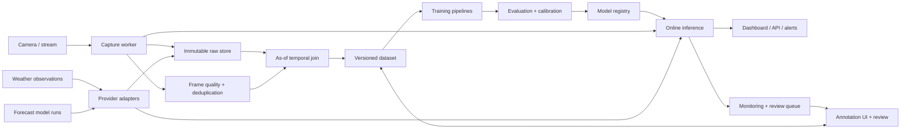

# Environmental Webcam Intelligence Framework

**Status:** implementation-ready design  
**Scope:** detection and prediction of recurring environmental phenomena from fixed outdoor cameras plus public weather data  
**Case study:** marine-layer detection below Mount Tamalpais peaks  

## 1. Purpose and design principles

This framework turns time-stamped webcam imagery and public weather data into:

1. a **detection probability** for what is visible in the current frame; and
2. a **forecast probability** that the phenomenon will be present at a future horizon.

Those are separate tasks. A detection model may use the current image and contemporaneous observations. A forecast model for time `t+h` may use only information that was available at issue time `t`; it must never use the future image, a later analysis, or a revised observation.

The framework is:

- **Task-configurable:** labels, regions of interest (ROIs), horizons, and quality rules live in configuration.
- **Camera-agnostic:** camera-specific geometry is metadata, not application logic.
- **Provider-neutral:** weather sources implement a common adapter contract.
- **Temporally honest:** every external datum records both its valid time and when it became available.
- **Uncertainty-aware:** abstention and unclassifiable reasons are first-class outputs.
- **Auditable:** raw inputs, transformations, annotations, model versions, and predictions are immutable or versioned.
- **Progressively scalable:** local files, DuckDB, and cron are sufficient for an MVP; object storage, Postgres, queues, and orchestration can replace them without changing data contracts.

Example tasks include valley fog, marine layers, cloud decks, wildfire smoke, snow cover, rainfall visibility, river stage, shoreline position, and vegetation change.

## 2. System architecture



### Independent components

| Component | Responsibility | Replaceable implementation |
|---|---|---|
| Capture | Poll image URL, extract frames from stream, timestamp, retry | Python worker, ffmpeg |
| Raw store | Preserve exact bytes and API responses | Local disk, S3-compatible object store |
| Metadata store | State, lineage, joins, annotations, predictions | DuckDB/Parquet, PostgreSQL |
| Quality service | Duplicates, night, blur, occlusion, movement | OpenCV + small classifiers |
| Weather adapters | Normalize observations, analyses, forecasts | Open-Meteo, NWS, AviationWeather |
| Dataset builder | Point-in-time-correct examples and splits | Polars/Pandas + Parquet |
| Annotation | Labeling, consensus, adjudication | Label Studio or custom UI |
| Training | Baselines, multimodal models, calibration | scikit-learn, LightGBM, PyTorch |
| Registry | Artifacts, metrics, approval state | MLflow |
| Serving | Batch/online inference and abstention | FastAPI + worker |
| Monitoring | Freshness, drift, quality, calibration | Prometheus/Grafana + scheduled reports |

## 3. Repository and configuration contract

Suggested layout:

```text
configs/
  cameras/
  tasks/
  weather_providers/
src/
  capture/
  quality/
  weather/
  datasets/
  annotation/
  models/
  evaluation/
  serving/
tests/
data/                  # local development only; ignored by Git
models/                # local artifacts; ignored by Git
```

A new use case should require configuration and labels, not edits to core pipeline code:

```yaml
camera:
  id: mt_tam_primary
  source_type: snapshot_url       # snapshot_url | hls | rtsp | file
  source_url_env: MT_TAM_CAMERA_URL
  latitude: null                  # populate after source verification
  longitude: null
  elevation_m: null
  timezone: America/Los_Angeles
  azimuth_deg: null
  capture_interval_seconds: 300
  license_record: docs/sources/mt_tam_camera.md
  expected_geometry:
    reference_image_uri: null
    movement_threshold_px: 12

task:
  id: cloud_below_peak_v1
  type: multiclass_detection
  primary_classes:
    - clouds_below_peak
    - no_clouds_below_peak
    - peak_obscured_uncertain
  quality_classes:
    - night_unusable
    - camera_artifact
  roi:
    type: polygon
    coordinates_normalized: []
  prediction_horizons_minutes: [30, 60, 180, 360]
  minimum_operating_sun_elevation_deg: -4
  abstention:
    max_predictive_entropy: 0.85
    max_missing_feature_fraction: 0.30
    min_image_quality_score: 0.55
```

Secrets and source URLs belong in environment variables or a secret manager. Configuration commits should contain stable identifiers and non-secret geometry only.

## 4. Webcam ingestion and image-quality controls

### Capture transaction

For every scheduled capture, including failures:

1. Generate `capture_id` and record the scheduled UTC time.
2. Request the source with bounded timeout, retries, and a descriptive User-Agent.
3. Record HTTP/stream status, response time, and source timestamp if exposed.
4. Timestamp receipt with a UTC clock; retain the camera-reported time separately.
5. Validate MIME type and decode the image.
6. Hash exact bytes (`sha256`) and perceptual content (`pHash`).
7. Write bytes once to `raw/{camera_id}/YYYY/MM/DD/{capture_id}.{ext}`.
8. Extract dimensions, EXIF if present, luminance, blur, and quality flags.
9. Create a standardized derivative without overwriting the raw frame.

The database row is written even when no valid image is obtained. This makes outages measurable and prevents silence from being confused with “event absent.”

### Quality and artifact signals

| Failure mode | Detection signal | Treatment |
|---|---|---|
| Exact duplicate | SHA-256 match | Link to prior frame; exclude repeated training examples |
| Frozen stream | low pHash distance over many captures | Flag outage/frozen; preserve one representative |
| Night | sun elevation plus luminance histogram | route to `night_unusable` unless task supports night |
| Blur/rain on lens | Laplacian variance, local streak/droplet model | quality score and artifact label |
| Glare/sun flare | saturated-area fraction and sun geometry | hard-case tag; abstain if severe |
| Camera movement | keypoint homography against reference | quarantine until ROI is re-registered |
| Compression/bad decode | decoder and blockiness checks | `bad_frame` |
| Seasonal lighting | retained as domain variation | balance splits; augmentation, not deletion |
| Smoke vs cloud/fog | visually ambiguous hard-case tag | require weather/air-quality context and review |

Camera movement is a state transition, not merely an image defect. When a sustained shift is detected, close the current `camera_pose_version`, create a candidate pose, and block automatic predictions until a reviewer approves new geometry.

## 5. Weather integration

### Provider adapter

Each provider implements:

```text
fetch_observations(location, start, end) -> RawResponse
fetch_analysis(location, start, end)     -> RawResponse
fetch_forecast(location, issue_time, horizons) -> RawResponse
normalize(raw_response) -> WeatherRecord[]
healthcheck() -> ProviderStatus
```

Every normalized record includes:

- provider, product, station/grid identifier, latitude, longitude, elevation;
- `data_kind`: `observation`, `analysis`, `forecast`, or `reanalysis`;
- `valid_time_utc`, `issue_time_utc`, `retrieved_at_utc`;
- forecast lead time and model cycle when applicable;
- original variable name/unit and normalized value/unit;
- provider quality flags and raw-response URI.

### Recommended providers

1. **Open-Meteo** is the easiest global default for gridded current, forecast, historical forecast, previous-run, and reanalysis features. Its forecast interface exposes temperature, dew point, humidity, pressure, precipitation, total/low/mid/high cloud cover, visibility, radiation, wind, and weather code. Historical products have different semantics: reanalysis is suitable for climate history, whereas archived model runs are needed for point-in-time forecast evaluation. See the [forecast documentation](https://open-meteo.com/en/docs), [historical forecast guidance](https://open-meteo.com/en/docs/historical-forecast-api), and [terms](https://open-meteo.com/en/terms). Verify the applicable usage tier before deployment; free access is described for non-commercial use.
2. **NOAA/NWS API** provides U.S. station observations, grid forecasts, alerts, and metadata without a fee. It requires a meaningful User-Agent and applies reasonable rate limits. See the [NWS API documentation](https://www.weather.gov/documentation/services-web-api).
3. **AviationWeather.gov** provides METAR observations and TAF forecasts with visibility, ceiling/sky layers, temperature, dew point, wind, pressure, and present weather. Its API documents a 15-day database window, a 100-requests/minute ceiling, and no more than one call/minute per endpoint thread; cache products are preferable for bulk collection. See the official [Data API](https://aviationweather.gov/data/api/).
4. **Optional task adapters:** NOAA river gauges/NWPS for river tasks, air-quality sources for smoke, and snow or satellite products for snow/vegetation. These are supplemental covariates; their spatial scale and latency must be recorded.

No provider is treated as truth. Station and grid features should coexist, with distance, elevation difference, age, and source encoded so the model can learn or be tested for mismatch.

### Temporal synchronization

Use UTC internally and preserve the source timezone string for display. A frame at `frame_time_utc` receives:

- nearest eligible observation within a configured tolerance, preferring observations whose reported availability is no later than the model issue time;
- analysis valid at frame time, explicitly marked as analysis;
- each forecast whose `issue_time_utc <= decision_time_utc` and whose valid time matches the target horizon;
- age, station distance, elevation difference, and interpolation method for each joined source.

Never backfill a live forecast feature with a later reanalysis in a training row. That creates silent look-ahead leakage. Delayed or corrected observations may be stored but must retain `retrieved_at_utc` and revision number.

Useful derived features include dew-point depression, wind vector components, pressure tendency, humidity/cloud trends, precipitation accumulation, cyclic hour/day encoding, solar elevation/azimuth, and station-to-camera elevation difference. All transformations are fitted on the training split only where fitting is required.

## 6. Canonical data schema

All identifiers are UUIDs unless noted. Large binary objects live in object storage; tables contain URIs and hashes.

### Core operational tables

| Table | Essential fields |
|---|---|
| `camera` | `camera_id`, name, lat/lon/elevation, timezone, source type, source rights, active interval |
| `camera_pose` | `pose_id`, `camera_id`, valid-from/to, azimuth, reference URI, ROI geometry, registration status |
| `capture` | `capture_id`, camera/pose IDs, scheduled/captured/received UTC, source URI, status, HTTP code, latency, raw URI, SHA-256, pHash |
| `image_asset` | asset ID, capture ID, variant, URI, dimensions, transform version, content hash |
| `frame_quality` | capture ID, model/rule version, luminance, blur, duplicate-of, movement, glare, lens obstruction, quality score, flags |
| `weather_raw` | response ID, provider/product, request hash, requested/retrieved UTC, status, payload URI, license/version |
| `weather_record` | record ID, raw response ID, kind, station/grid metadata, valid/issue/retrieved UTC, lead minutes, variable, value, unit, quality |
| `annotation` | annotation ID, capture/task IDs, label, tags, annotator pseudonym, confidence, created UTC, UI/model version, supersedes ID |
| `adjudication` | capture/task IDs, consensus label, method, adjudicator, rationale, version |
| `model_version` | model ID, task, code/data/config hashes, artifact URI, metrics, calibration method, approval state |
| `prediction` | capture/model/task IDs, issued UTC, target valid UTC, class probabilities, uncertainty, abstained, reason codes, feature freshness |

### Dataset manifest and model-ready row

Each immutable dataset release has a manifest containing:

- dataset ID and creation time;
- SQL/query or code commit that produced it;
- camera, pose, task, annotation-policy, and preprocessing versions;
- raw object hashes or parent snapshot ID;
- split assignment method and random seed;
- feature list, units, missingness policy, and row counts;
- license/retention constraints.

Model-ready rows use a stable key:

```text
(dataset_id, task_id, camera_id, capture_id, target_valid_time_utc)
```

They include image URI, label and label status, weather features plus source/provenance fields, quality features, temporal features, horizon, split, and sample weight. Store wide training tables in Parquet; keep normalized operational weather data in long form.

### Missingness

- Preserve missing values and add missingness/age indicators.
- Do not convert missing cloud cover or visibility to zero.
- Fit imputers on training data only.
- Permit image-only and weather-only fallback predictions if those variants were trained and calibrated.
- Abstain when the available modality set or freshness falls outside validated operating conditions.

## 7. Annotation plan

### Label ontology

Every task has a primary phenomenon label and orthogonal quality tags. The general minimum vocabulary is:

- `positive`
- `negative`
- `uncertain_ambiguous`
- `obscured`
- `night`
- `bad_frame`
- `camera_moved`

Task-specific labels map onto that vocabulary. Multi-select artifact tags include glare, rain-on-lens, smoke/haze ambiguity, partial occlusion, blur, compression error, and unusual camera pose.

Annotators receive:

- a written definition with positive, negative, and boundary examples;
- an ROI overlay and permitted context area;
- a rule that uncertainty is preferable to guessing;
- no weather features during primary image labeling, preventing weather-driven confirmation bias;
- an optional second pass with temporal neighbors for adjudication, explicitly recorded.

### Seed dataset

Start with approximately **2,000–4,000 usable daylight frames per task**, or a smaller pilot of 500 if data is scarce. Sample across month, hour, weather regime, quality, and camera pose rather than uniformly from consecutive frames. Cap near-duplicates per hour/event episode.

Double-label at least 15–20% and all ambiguous examples. Report Cohen’s kappa for two raters or Krippendorff’s alpha for multiple raters, plus per-class disagreement. Adjudicate disagreements and update the guide when a repeated ambiguity appears.

### Reducing annotation cost

Run active-learning rounds only after a random, untouched evaluation set exists:

1. Train a seed model.
2. Select a mixture of high entropy, image/weather disagreement, rare regimes, drifted embeddings, and random controls.
3. Cluster embeddings and cap examples per event episode to avoid redundant labeling.
4. Accept pseudo-labels only above class-specific calibrated thresholds and never place them in validation/test sets.
5. Weight pseudo-labels below human labels and audit a sample each round.
6. Periodically sample confident predictions to detect systematic confident errors.

## 8. Modeling strategy

### Targets

**Detection at `t`:**

```text
P(event visible at t | image_t, weather available by t, metadata)
```

**Prediction at horizon `h`:**

```text
P(event at t+h | images through t, observations available by t,
                    forecast issued by t for t+h, metadata)
```

For pure future forecasting, current-image embeddings or recent detection probabilities may be used as lagged state. The image at `t+h` is the outcome label and is never an input.

### Baseline ladder

1. **Rules and prevalence:** seasonal/hourly prevalence, dew-point-spread rules, persistence.
2. **Weather-only:** regularized logistic regression, then LightGBM/XGBoost with missing indicators.
3. **Image-only:** frozen pretrained embedding + logistic regression; then fine-tuned CNN or vision transformer.
4. **Late fusion:** calibrated image and weather logits plus metadata fed to a small logistic/MLP stacker. This is the preferred first multimodal model because each modality can be audited and can fail independently.
5. **Early fusion:** concatenate trainable image embedding, weather embedding, quality, and time features; use modality dropout during training.
6. **Temporal model, if justified:** sequence of image embeddings and weather history using a temporal convolution or transformer.

Start with pretrained open-source encoders such as ResNet/EfficientNet or a vision transformer. Record exact weights and licenses. Crop or mask the task ROI, but retain a low-resolution full-frame context branch where useful.

### Calibration, uncertainty, and abstention

- Keep a chronological calibration partition separate from training and final test.
- Compare Platt scaling, isotonic regression, and temperature scaling.
- Report expected calibration error, adaptive calibration error, Brier score, and reliability diagrams.
- Estimate epistemic uncertainty with a small deep ensemble or bootstrap ensemble; use predictive entropy for total uncertainty.
- Return class probabilities even when abstaining, alongside a machine-readable reason:
  `night`, `low_quality`, `camera_moved`, `weather_stale`, `missing_modality`,
  `out_of_distribution`, or `high_uncertainty`.

Explainability is diagnostic evidence, not proof. Provide Grad-CAM/attention rollout for the image encoder, SHAP or permutation importance for tabular features, and partial dependence/ALE plots for important weather features. Review whether saliency falls on the phenomenon ROI or on timestamps, logos, glare, droplets, and other shortcuts.

## 9. Evaluation and generalization

### Metrics

For each class and overall:

- precision, recall, F1, support, confusion matrix;
- ROC-AUC and PR-AUC (one-vs-rest for multiclass);
- Brier score and calibration error;
- coverage versus risk for abstaining models;
- latency, freshness, and missing-modality availability;
- bootstrap confidence intervals grouped by event episode/day, not individual frame.

PR-AUC and thresholded precision/recall are primary when events are rare. Select thresholds from validation data to satisfy the deployment cost objective; never choose them on the test set.

### Leakage-resistant split suite

Avoid random frame splits: adjacent frames are almost duplicates.

| Test | Split unit | Question |
|---|---|---|
| Temporal | contiguous weeks/months and event episodes | Does it work later? |
| Seasonal | hold out an entire season or month blocks | Does it survive lighting/weather shifts? |
| Camera-specific | unseen pose or camera | Does it depend on scenery/artifacts? |
| Location | leave-one-location-out | Does it transfer geographically? |
| Few-shot transfer | 0, 25, 100, 500 labels at new site | How much local labeling is required? |
| Hard-case | curated glare, smoke, haze, rain blur, dawn/dusk, occlusion | Does it fail safely? |

All preprocessing, feature selection, imputation, calibration, and hyperparameter selection occur inside the training/validation boundary.

### Required comparisons

- weather-only versus image-only versus multimodal;
- current observations versus forecasts available at issue time;
- global model versus camera-specific model;
- full image versus ROI;
- with and without quality gating;
- zero-shot new camera versus few-shot fine-tuning;
- performance and calibration by camera, season, solar elevation, quality tier, weather provider, and missing-data pattern.

Manually review false positives and negatives with blinded reviewers. Record causal categories such as annotation ambiguity, camera artifact, station mismatch, unusual event, ROI failure, or model shortcut. Promote repeated categories into the hard-case suite.

## 10. Deployment and reliability

### Online flow

1. Scheduler creates capture attempt.
2. Capture and quality checks complete.
3. Weather adapters retrieve/cache required records.
4. Feature builder performs an as-of join.
5. Approved model emits probabilities and uncertainty.
6. Policy applies quality/freshness/OOD gates.
7. Prediction is stored and dashboard/API is updated.

The status display should show:

- latest valid frame and capture time;
- probability for each target class and selected operating label;
- confidence/uncertainty and abstention reason;
- weather values with observation/forecast badges and ages;
- camera, pose, model, task, and calibration versions;
- next future-horizon probabilities when forecasting is enabled;
- explicit “data unavailable/stale” states.

Serve the last result only with its original timestamp; never present it as current after the freshness limit. Retries use exponential backoff and jitter. Weather requests are cached by provider/request/model-cycle. A circuit breaker stops hammering failed providers.

### Monitoring and promotion

Track capture success, duplicate/frozen rate, weather latency, feature missingness, inference latency, abstention rate, class distribution, embedding drift, camera registration error, and post-review calibration. Alert on thresholds by camera.

Model promotion requires:

- passing frozen temporal and hard-case tests;
- no material subgroup regression beyond documented tolerances;
- calibrated probabilities on a held-out partition;
- successful shadow deployment;
- rollback artifact and configuration;
- human approval.

Labels arrive late, so operational drift signals are early warnings, not replacements for delayed performance evaluation.

## 11. Mount Tamalpais case study

### Objective and geometry

At a regular interval, estimate whether clouds/fog forming a marine layer are visibly **below the designated Mount Tam peak skyline**. The camera’s verified source, coordinates, direction, rights, and stable peak/foreground polygons must be entered in camera configuration before collection.

This wording matters: the model observes the camera’s view, not the entire mountain or regional atmosphere.

### Labels

| Case-study label | General mapping | Operational definition |
|---|---|---|
| `clouds_below_peak` | positive | Peak/ridge reference remains identifiable and cloud/fog occupies a material portion of the configured below-ridge ROI |
| `no_clouds_below_peak` | negative | Below-ridge ROI is sufficiently visible with no qualifying cloud/fog layer |
| `peak_obscured_uncertain` | uncertain/obscured | Skyline cannot be located reliably, or cloud height relative to peak cannot be determined |
| `night_unusable` | night | Illumination is below the validated operating range |
| `camera_artifact` | bad frame/camera moved | Droplets, glare, blur, obstruction, frozen frame, or pose shift prevents a valid decision |

The annotation guide must define “material portion” with visual examples after inspecting the actual view. Do not infer `clouds_below_peak` merely because low-cloud weather features are high.

### Collection and weather

- Capture every **5 minutes**; retain all attempts.
- Use a perceptual-hash rule to avoid flooding training with frozen or near-identical frames.
- Query Open-Meteo grid data at the camera and, if useful, at an upwind coastal point.
- Collect nearby METAR observations from candidate stations chosen by distance, elevation, reporting completeness, and exposure—not distance alone.
- Optionally use NWS station/grid observations as an independent source.
- Store temperature, dew point, humidity, pressure, wind vector, precipitation, cloud layers, visibility, radiation, weather code, and source freshness.
- Derive dew-point depression, pressure tendency, onshore wind component, recent cloud trend, solar geometry, and camera/station elevation mismatch.

The Bay Area’s terrain and marine boundary layer can differ sharply over short distances. Preserve each source separately before testing any aggregation.

### First experiments

1. Collect four to eight weeks before judging season-level performance; continue through multiple seasonal regimes.
2. Label a stratified seed of 2,000 frames, including all quality categories; double-label 20%.
3. Freeze contiguous temporal test blocks before active learning.
4. Train:
   - persistence and seasonal prevalence;
   - weather-only regularized logistic regression and gradient-boosted trees;
   - image-only frozen pretrained embeddings + logistic regression;
   - image-only fine-tuned encoder;
   - late-fusion multimodal model.
5. Calibrate on a later contiguous block.
6. Evaluate detection and separate 30-minute, 1-hour, 3-hour, and 6-hour prediction horizons.
7. Shadow-deploy and review uncertain, image/weather-disagreement, and high-confidence samples weekly.

### Mount Tam acceptance criteria for an MVP

- At least 95% of scheduled capture attempts leave an auditable row.
- Duplicate, night, decode failure, and camera movement are represented in quality outputs.
- Dataset reconstruction is deterministic from a manifest.
- No forecast feature has an issue/retrieval time after its decision time.
- All three usable-scene labels have meaningful support in a frozen test set.
- The report includes per-class PR curves, calibration, hard cases, and episode-grouped confidence intervals.
- The UI abstains rather than emitting an ordinary negative when the peak is obscured or the camera is unusable.
- A second camera can be added using configuration plus ROI registration, without editing pipeline code.

## 12. Minimal viable implementation roadmap

### Phase 0 — source and task contract (2–3 days)

- Verify webcam permission, URL stability, attribution, coordinates, pose, and retention policy.
- Capture reference images and draw normalized peak/below-peak ROIs.
- Approve label guide, weather providers, cadence, and decision horizons.

**Exit:** signed-off source record, camera/task YAML, and example labels.

### Phase 1 — collection and storage (1 week)

- Implement capture attempts, immutable raw paths, hashing, retries, and metadata.
- Implement Open-Meteo plus one observation adapter.
- Store raw JSON and normalized records; add UTC/as-of tests.
- Add basic duplicate, darkness, blur, and movement checks.

**Exit:** seven continuous days with auditable outage and freshness metrics.

### Phase 2 — annotation and dataset v1 (1–2 weeks, overlapping collection)

- Deploy Label Studio or a small task-specific UI.
- Label stratified seed; measure agreement and adjudicate.
- Build deterministic Parquet tables and immutable manifests.
- Freeze temporal, calibration, and hard-case partitions.

**Exit:** versioned dataset with schema/lineage tests and label-quality report.

### Phase 3 — baselines and multimodal model (1–2 weeks)

- Train prevalence, weather-only, and image-only baselines.
- Train late fusion, calibrate, and implement abstention.
- Produce temporal/seasonal/hard-case evaluation and error review.

**Exit:** an approved candidate that beats declared baselines and fails safely.

### Phase 4 — shadow deployment (1 week)

- Serve current probabilities, freshness, model version, and reasons.
- Add dashboards, alerts, provider caching, retries, and rollback.
- Review predictions daily without public-safety claims.

**Exit:** stable shadow service with monitoring and weekly review workflow.

### Phase 5 — transfer and scale (ongoing)

- Add at least one new camera/task via configuration.
- Run zero-shot and 25/100/500-label transfer tests.
- Introduce active learning, pseudo-label audits, and scheduled retraining.
- Migrate storage/orchestration only when volume or reliability requires it.

## 13. Legal, ethical, and reliability checklist

- Record source owner, terms snapshot/date, attribution, capture permission, redistribution rights, and takedown contact.
- Avoid retaining people/vehicles at unnecessary resolution; mask privacy-sensitive regions when practical.
- Respect API licenses, attribution, caching rules, rate limits, and commercial-use restrictions.
- Keep annotator identities pseudonymous and restrict access to raw imagery.
- Set retention separately for raw images, derivatives, logs, labels, and public displays.
- Publish model scope, known failure modes, data freshness, and last validation date.
- Do not describe the output as an aviation, wildfire, flood, driving, or emergency warning unless separately validated and governed for that use.
- Require human confirmation for consequential alerts and provide a visible abstention/unavailable state.
- Maintain incident, rollback, and camera-movement response procedures.

## 14. Definition of done

The framework is reusable when a new deployment can be created by:

1. registering a licensed camera and pose;
2. choosing provider adapters;
3. defining labels, ROIs, horizons, and quality policy;
4. collecting and annotating a local seed;
5. running the same dataset, training, evaluation, calibration, registry, and serving contracts;
6. demonstrating performance on untouched time periods and, where claimed, unseen cameras or locations.

The result is an evidence-producing monitoring system—not an oracle. Its most important behavior in unfamiliar or degraded conditions is to say that it does not know.
